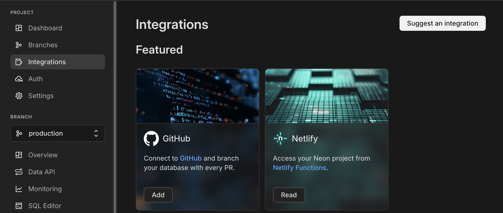

<picture>
  <source media="(prefers-color-scheme: dark)" srcset="https://neon.com/brand/neon-logo-dark-color.svg">
  <source media="(prefers-color-scheme: light)" srcset="https://neon.com/brand/neon-logo-light-color.svg">
  
</picture>

### Automated E2E Testing with Neon Branching and Playwright

A complete example of a CI/CD pipeline for running isolated, database-dependent E2E tests for every pull request using Neon, Playwright, and GitHub Actions.

---

End-to-end (E2E) testing is crucial for ensuring application quality, but it becomes complex when database changes are involved. Running tests that depend on a specific schema against a shared staging environment can lead to flaky results and development bottlenecks.

This repository demonstrates how to solve this problem by combining the power of [**Neon's instant database branching**](https://neon.com/branching) with [**Playwright**](https://playwright.dev) and [**GitHub Actions**](https://github.com/features/actions). It provides a fully automated E2E testing pipeline where every pull request gets its own isolated database, perfectly mirroring your code branching strategy.

Follow the full guide on [Neon Blog: Automated E2E Testing with Neon Branching and Playwright](https://neon.com/guides/e2e-playwright-tests-with-neon-branching) for a step-by-step walkthrough.

## ✨ Key features

This example will show you how to build a GitHub Actions workflow that, for every pull request:

-   **Creates a new, isolated database branch** using Neon's copy-on-write cloning.
-   **Applies schema migrations** to that specific branch.
-   **Builds and runs a Next.js application** against the new database.
-   **Executes a full suite of Playwright tests** in a clean, predictable environment.
-   **Posts a schema diff summary** as a comment directly in the pull request.
-   **Cleans up resources** by deleting the database branch when the PR is closed.
-   **Applies migrations to production** automatically upon merging.

## 🚀 Get started

### Prerequisites

Before you start, you'll need a few things:

1.  A **[Neon account](https://console.neon.tech)**.
2.  A **[GitHub account](https://github.com/)**.
3.  **[Node.js](https://nodejs.org/)** installed locally.

### 1. Initial setup

First, clone this repository, install the dependencies, and set up your local environment.

```bash
# Clone the repository
git clone https://github.com/neondatabase-labs/neon-playwright-example.git
cd neon-playwright-example

# Install dependencies
npm install

# Create your local environment file
cp .env.example .env
```

Next, open the `.env` file and add your Neon database connection string. You can find this in your Neon project dashboard under **Connection Details**.

```env
DATABASE_URL="postgres://[user]:[password]@[neon_hostname]/[dbname]?sslmode=require&channel_binding=require"
```

Apply the schema migrations to your main database branch and test the application locally.

```bash
# Apply migrations
npm run db:migrate

# Run the dev server
npm run dev
```

Open `http://localhost:3000` to see the Todo app. You can also run the local E2E tests to confirm everything works:

```bash
npm run test:e2e
```

### 2. Push to your own GitHub repository

To use GitHub Actions, you need to push this code to your own repository.

```bash
# Remove the original git history and initialize a new repo
rm -rf .git
git init
git add .
git commit -m "Initial commit"
git branch -M main

# Add your new repository's URL and push
git remote add origin https://github.com/<YOUR_USERNAME>/<YOUR_REPO>.git
git push -u origin main
```

### 3. Configure Neon and GitHub

Connect Neon to your new repository to enable the automated workflow.

1.  **Install the Neon GitHub Integration**:
    -   In the Neon Console, navigate to your project's **Integrations** page.
    -   Click **Add** on the GitHub integration card and follow the steps to connect it to your repository.
        
    -   This will automatically create two repository items: a `NEON_API_KEY` secret and a `NEON_PROJECT_ID` variable.

2.  **Add Production Database Secret**:
    -   In your GitHub repository, go to **Settings** > **Secrets and variables** > **Actions**.
    -   Create a **New repository secret**.
    -   Name the secret `DATABASE_URL`.
    -   For the value, paste the connection string to your **primary `main` branch** from the Neon Console. This secret is used only to apply migrations after a PR is successfully merged.

**Set workflow permissions**:
    
> [!IMPORTANT]
> For the workflow to post comments on your pull requests, you need to enable the correct permissions.
> In your GitHub repository, go to **Settings** > **Actions** > **General**, and under **Workflow permissions**, select **Read and write permissions**.

## ⚙️ How it works

The magic happens in the `.github/workflows/playwright.yml` file. This workflow is triggered on every `pull_request` event.

It is broken down into three main jobs:

1.  **`setup`**: A quick job that determines the current Git branch name to use in naming the Neon database branch.

2.  **`create_neon_branch_and_run_tests`**: This is the core testing job, triggered when a PR is opened or updated.
    -   **Create Neon Branch**: Uses the [`neondatabase/create-branch-action`](https://github.com/marketplace/actions/neon-create-branch-github-action) to instantly create a new data branch.
    -   **Checkout & Setup**: Checks out the code and sets up Node.js.
    -   **Migrate Database**: Runs `npm run db:migrate` against the **newly created branch's connection string**.
    -   **Build & Start App**: Builds the Next.js application and starts it in the background, configured to use the new database branch.
    -   **Run Playwright Tests**: Executes the full E2E test suite.
    -   **Post Schema Diff**: Uses the [`neondatabase/schema-diff-action`](https://github.com/marketplace/actions/neon-schema-diff-github-action) to compare the PR's branch with the base branch and posts a summary as a PR comment.

3.  **`delete_neon_branch`**: This is the cleanup job, triggered when a PR is closed.
    -   **Apply Migrations to Production**: If the PR was merged (`github.event.pull_request.merged == true`), it checks out the code and runs migrations against the `main` database using the `DATABASE_URL` secret.
    -   **Delete Neon Branch**: Uses the [`neondatabase/delete-branch-action`](https://github.com/marketplace/actions/neon-database-delete-branch) to delete the temporary data branch, keeping your Neon project tidy.

## 🧪 Seeing it in Action

Ready to test the full workflow?

1.  Create a new feature branch in your local repository:
    ```bash
    git checkout -b feature/add-timestamp
    ```
2.  Make a schema change. For example, add a `createdAt` column in `app/db/schema.ts`.
    > Checkout the [full guide](https://neon.com/guides/e2e-playwright-tests-with-neon-branching) for detailed code example.
3.  Update the UI in `app/todos.tsx` to display the new timestamp.
4.  Add a new Playwright test in `tests/todos.spec.ts` to verify the timestamp is displayed.
5.  Commit your changes and push the branch to GitHub:
    ```bash
    git add .
    git commit -m "feat: add createdAt timestamp to todos"
    git push origin feature/add-timestamp
    ```
6.  Open a pull request on GitHub.

Once the PR is opened, you can watch the "Playwright Tests" action run. You will see it create a database branch, run the tests, and post a schema diff comment on your PR. When you merge, it will apply the migration to production and delete the preview branch.

## 📚 Learn more

-   [Neon Database Branching Guide](https://neon.com/docs/introduction/branching)
-   [Neon GitHub Integration Guide](https://neon.com/docs/guides/neon-github-integration)
-   [Playwright Documentation](https://playwright.dev/docs/intro)
-   [GitHub Actions Documentation](https://docs.github.com/en/actions)